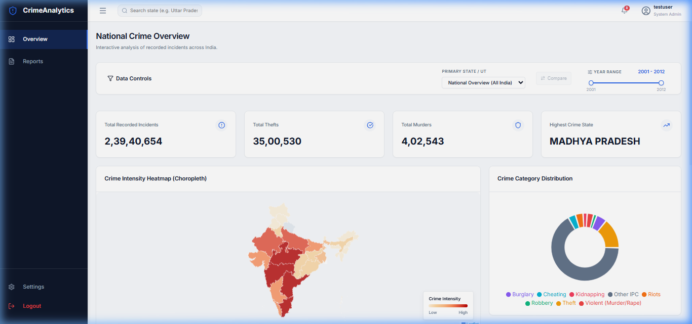

# 🛡️ National Crime Data Intelligence

A full-stack web application to analyze and visualize crime data across Indian states and union territories.



## 📌 About

This platform provides an interactive dashboard to explore **state-wise crime statistics** from 2001 to 2012. Users can view trends, compare states, explore a choropleth heatmap of India, and export detailed reports — all behind a secure login system.

## 🛠️ Tech Stack

| Layer | Technologies |
|-------|-------------|
| **Frontend** | React, Vite, React Router, Recharts, Leaflet, CSS |
| **Backend** | Node.js, Express |
| **Database** | MongoDB Atlas, Mongoose |
| **Auth** | JWT, bcryptjs |

## ✨ Key Features

- 🔐 User registration & login with JWT authentication
- 📊 Interactive charts (line, bar, pie) using Recharts
- 🗺️ India choropleth heatmap with Leaflet + GeoJSON
- 🔍 Filter by state, year range, and compare two states
- 📋 Paginated reports table with CSV export
- 📱 Responsive, professional UI

## 🚀 How to Run

```bash
# Install dependencies
npm install
cd server && npm install && cd ..

# Start backend (Terminal 1)
cd server
node index.js

# Start frontend (Terminal 2)
npm run dev
```

Open **http://localhost:5173** in your browser.

> **Note:** Add your MongoDB Atlas connection string in `server/.env`

## 📄 License

For educational and academic purposes only.
